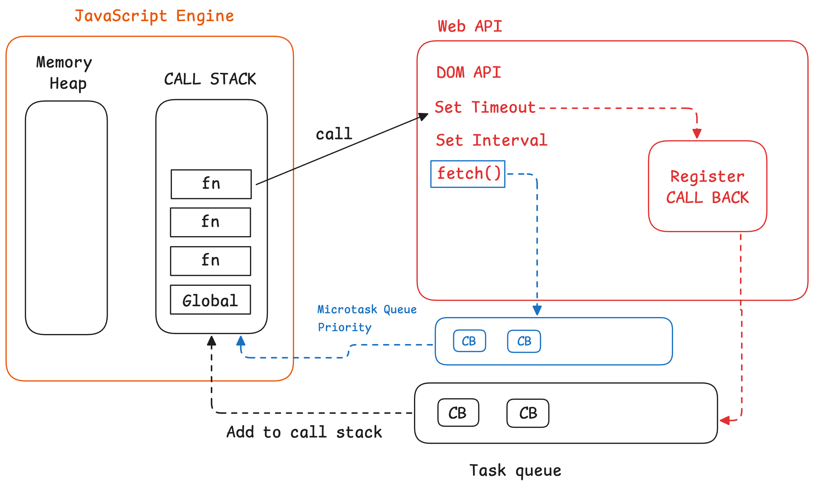

## Promises in JavaScript

Promises are a way to handle asynchronous operations in JavaScript. They provide a way to handle the result of an asynchronous operation, whether it is successful or not.

Example:

```js
const promise = new Promise((resolve, reject) => {
  // Do something asynchronous
  setTimeout(() => {
    if (success) {
      resolve("Operation successful");
    } else {
      reject("Operation failed");
    }
  }, 1000);
});

promise.then((result) => {
  console.log(result);
}).catch((error) => {
  console.error(error);
});
```
Why fetch is processed at the earliest even though it is async?
---------------

**Ans:** All the fetch calls are sent to the call-back queue (priority queue) hence the order of execution makes sure that the fetch is processed first.


